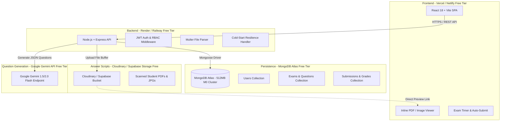

# Online Examination System - System Architecture & Tech Stack

## Overview
This full-stack online examination platform is engineered to operate 100% within free-tier cloud quotas without requiring any paid subscriptions or credit cards.

## Free-Tier Infrastructure Architecture

---

## Free-Tier Operational Constraints & Solutions

| Constraint / Limitation | Free-Tier Quota / Behavior | System Solution / Handling |
| :--- | :--- | :--- |
| **Backend Inactivity Sleep** | Render Web Services sleep after 15 mins of inactivity. First request takes 15-30s. | React UI features a dynamic `ColdStartBanner` and retry mechanism to inform users gracefully during cold starts. |
| **Database Storage** | MongoDB Atlas 512 MB shared storage limit. | Minimal JSON documents for exams & submissions; scanned images/PDFs are stored in external cloud storage, saving DB space. |
| **File Storage** | Cloudinary 25 GB net storage / Supabase 1 GB free bucket. | Strict client & server-side file upload limits (max 5MB per upload, PDF/JPG/PNG only). Compression recommendations provided. |
| **AI Question Generation** | Gemini API free tier (15 requests/min, 1,500 requests/day). | Rate limiting middleware + fallback structured JSON generator template for seamless user experience. |
| **Bandwidth** | Vercel 100GB/month bandwidth. | Optimized static assets, single-page application bundling, and direct CDN image loading. |

---

## Role-Based Access Control (RBAC) Matrix

- **Teacher / Admin**:
  - Full CRUD on Exam creation & scheduling.
  - Auto-generate questions via AI prompt tuning (Subject, Topic, Difficulty, Count).
  - Edit/approve generated questions prior to publication.
  - View all student attempts and access uploaded scanned scripts.
  - Grade submissions inline (view PDF/image, assign marks, input feedback).
  - Publish exam results.
- **Student**:
  - Register & login.
  - Access active scheduled exams.
  - View questions on-screen with real-time exam countdown timer.
  - Read instructions to write answers on physical paper.
  - Upload photo/scan of physical answer script before exam expiration.
  - View submission confirmation, score, and teacher feedback after publication.
